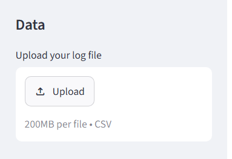
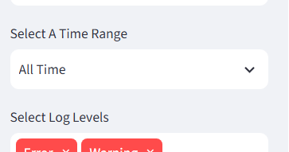
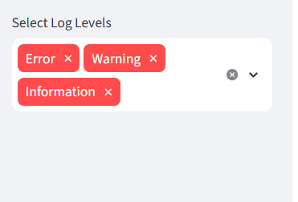
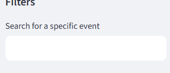
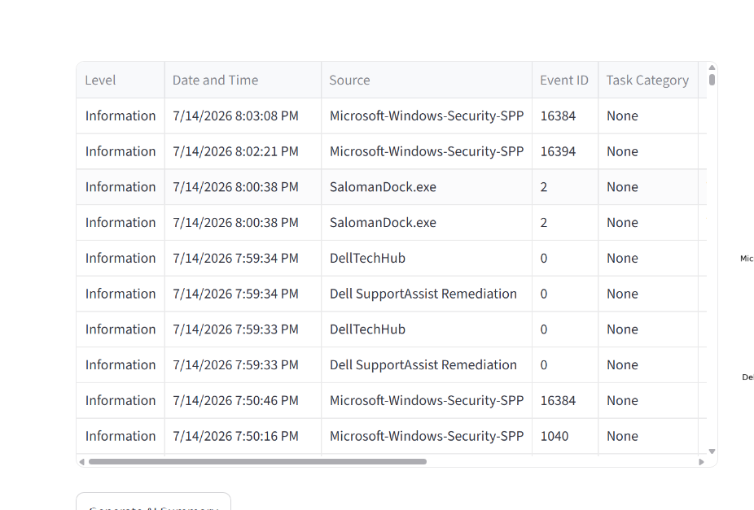
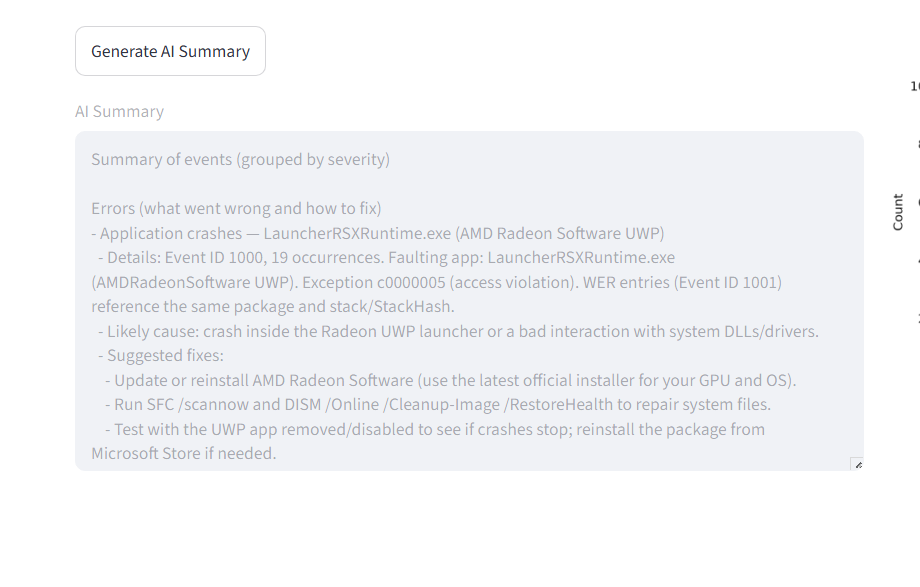
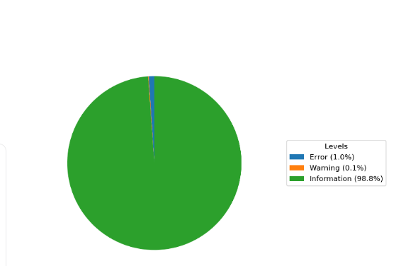
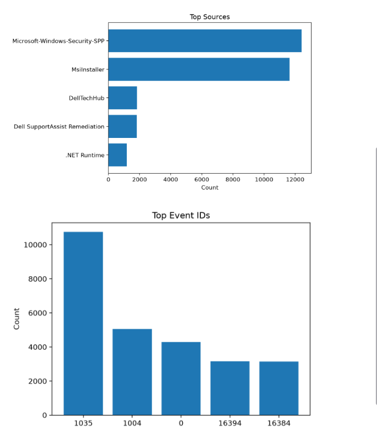
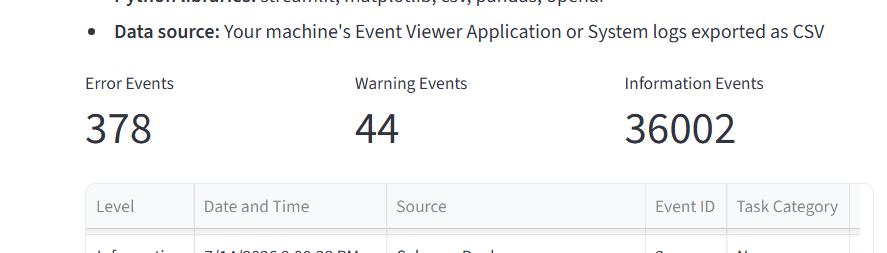
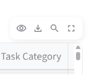

# Tell Me Why

  
Inspired by one of my favorite Taylor Swift songs, _Tell Me Why_, this web app takes CSV files exported from Event Viewer System or Application logs and will tell you why any errors or warnings appeared as well as how to fix them.

## Usage

Just click [this link](https://tellmewhy-hh6c27zz4vaawitfzqdxka.streamlit.app/)

## Features

### Upload Event Viewer CSV files 

### Select timeframe 

### Filter levels 

### Search keywords 

### Display the event information 

### Display AI summary and suggestions 

### Pie chart of level distribution 

### Bar charts of top sources and event IDs 

### Metrics containing event level counts 

### Download the filtered events to CSV 

## Requirements

- Python 3.12.3+
- streamlit
- matplotlib
- pandas
- openai

